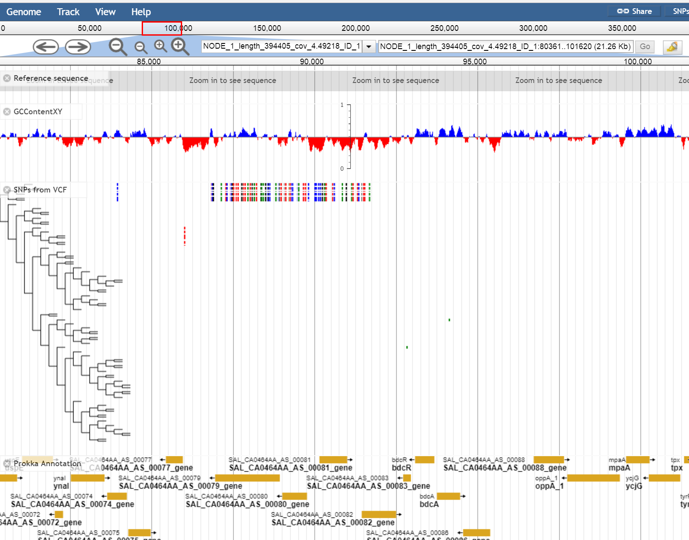

# jbrowse_snp_viewer

## Description
A plugin for the genome browser Jbrowse. Displays  a tree (nwk file to be specified in the track data) and SNPd  (from a gzipped VCF file plus index )



## Installation
Place the SNPViewer folder in the plugins director of your JBrowse installation and add it to your jbrowse_conf.json
```
"plugins":[....,"SNPViewer"]
```
In the trackList.json add the the track descriptor pointing to the vcf file (urlTemplate) and tree (nwk_file) e.g.
```
{
    "key": "test_1", 
    "label": "snp_7828", 
    "nwk_file": "7828.nwk", 
    "storeClass": "SNPViewer/Store/SeqFeature/MultiTabix", 
    "type": "SNPViewer/View/Track/SNPViewCanvas", 
    "urlTemplate": "7828.vcf.gz"
}
```

## Files Required
* A gzipped vcf file. A simple example would be the following 
```
##fileformat=VCFv4.2
##FORMAT=<ID=GT,Number=1,Type=Integer,Description="Genotype">
##INFO=<ID=SYN,Number=1,Type=String,Description="Synonymous">
#CHROM       	POS	  ID	REF	ALT	QUAL	FILTER	INFO	FORMAT	S1	S2	S3	S4	S5	S6	S7	S8
NZ_CP014981.1	11123	snp_1	C   T	   .     PASS  SYN=S    GT   0   0   0   0   0   0   0   1
NZ_CP014981.1	17309	snp_2	T   G	   .     PASS  SYN=NS   GT   1   1   1   1   1   1   1   1
```

* An index is also required - This can be generated using tabix


* A tree in nwk format, the identifiers have to match those in the vcf file  e.g
```
((S1:2.25178e-06,(S2:3.27529e-06,(S3:2.45646e-06,.................)
```
